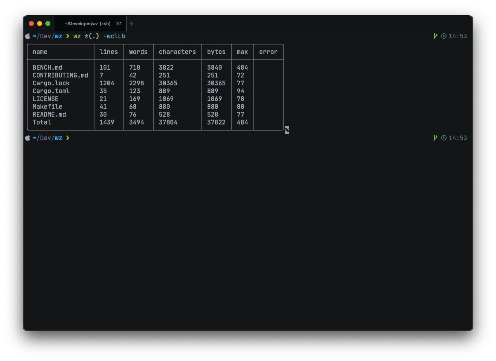

<!-- cargo-sync-readme start -->

# Wortzahl! Count words **fast**

`wz` is a faster alternative to GNU wc with UTF8 support and human readable
output, written in Rust



# Features

## Human readable and machine readable formats

Output the results on a nice table, or pipe them to another program
that reads JSON. Stop messing with `sed` and `awk`!

```sh
$ wz *(.) --output json  
{"total":{"lines":1439,"words":3494,"bytes":37822},"summary":{"Cargo.lock":{"Ok":{"lines":1204,"words":2298,"bytes":30365}},"Cargo.toml":{"Ok":{"lines":35,"words":123,"bytes":889}},"LICENSE":{"Ok":{"lines":21,"words":169,"bytes":1069}},"Makefile":{"Ok":{"lines":41,"words":68,"bytes":880}},"README.md":{"Ok":{"lines":30,"words":76,"bytes":528}},"BENCH.md":{"Ok":{"lines":101,"words":718,"bytes":3840}},"CONTRIBUTING.md":{"Ok":{"lines":7,"words":42,"bytes":251}}}}%
```

## Multiple encoding support

Characters and line lengths are count using UTF8 or UTF16[^1] encoding,
meaning that files with non ASCII characters are count correctly

## Multiple line breaks support

Got a file from an old Macintosh? Change the line break to carriage
returns ('\r')

```sh
wz macintosh.txt -n cr
```

## Multithreading

`wz` uses [rayon] under the hood, meaning that files are counted in parallel

# Installation

## Cargo

```sh
cargo install wz
cargo install --git https://github.com/Altair-Bueno/wz.git
```

# Performance

See [BENCH.md](BENCH.md)

# Usage

Run `wz --help` to see the full list of options

[rayon]: https://crates.io/crates/rayon

[^1]: UTF16 support coming later

<!-- cargo-sync-readme end -->
